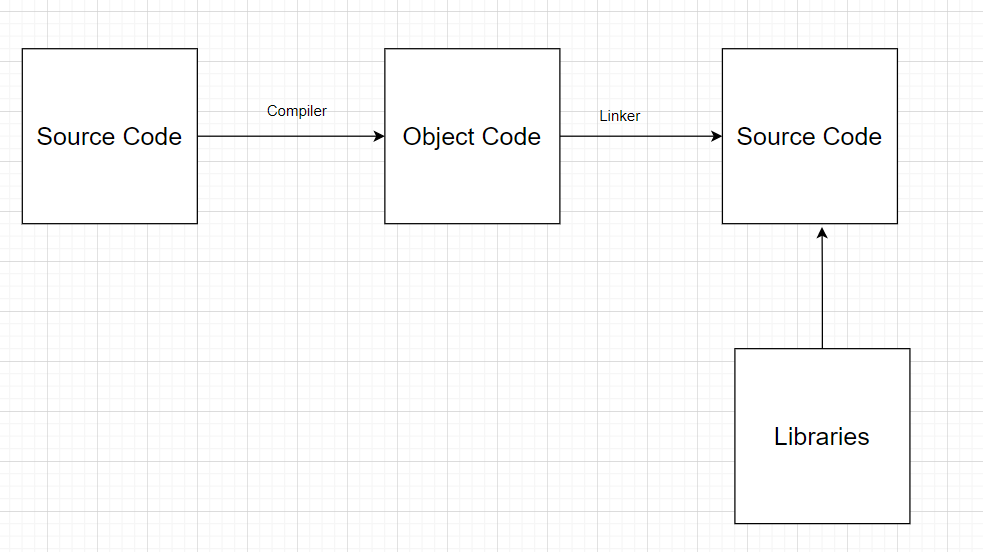

# How C++ Works

## We are gonna learn how we are gonna start from source files and then combin them to convert into binary

```c++
#include <iostream>

int main()
{
    std::cout << "Hello World!"<<std::endl;
    std::cin.get();
}
```

This is a preety basic program.

```
# - preprocessor statement : which is done before any proessing
```

```
include - it tells to include other files in this file/program
```

```
main --there should be an entry point in our program
```

C++ programs runs line by line from top to bottom.

We can return or not return smething from the main function as for this only the compiler asumes if we are not returning anything then we are returning 0.

```
<< >> - are the overloaded operators , it just acts as the functions , then it makes more sense.We are pushing this hello world to cout
```

```
cin.get() - waits for us to click enter
```

# So how we get the binary - there are actually many steps for this.

1. First if the preprocessor statement before we compile the file, here it just copies and paste that files - we include this to use cout and cin funtions

2. Now compiler transform from c++ code to actual machine code.

3. Configuration - set of rule for building

4. Each CPP gets compiled

5. Every cpp files gets compiled individually to .obj files so now we need to link this all obj files and combine them together, SO linker comes and combine them to make one single exe files.

6. In visual studio try t just compile a c++ code and go to the directory where we will find the .obj file.

7. For example lets take we have two cpp files and we dont wanna use cout , rather we wil create our own funtion to print

```c++
#include <iostream>

void log(const char* message)
{
    std::cout << message << std::endl;
}

int main()
{
    log("hello world");
    std::cin.get();

}
```

Now take this function and take it to different files

Creating a <b>log.cpp</b> file

```c++
#include <iostream>

void log(const char* message)
{
    std::cout << message << std::endl;
}
```

Since we are compiling each file seperatly so it dosent know where is log function so we can avoid this by declaration

We are just telling compiler to believe that there is a function just take it and compiler belives us.

Defination is actually in aother log.cpp file

```c++

#include <iostream>

void log(const char* message);

int main()
{
    log("hello world");
    std::cin.get();

}
```

How does it actually run the right file--

Thats where the linker comes in , so when we click build then the each c++ code is compiled seperately and then linker find the defination of log function and wire up with it , but when the linker is not able to find the funtion then it gives the <b>Linker Error </b>, which is preety scary looking.

# Process

1. Source code

2. Object code ( compiled)

3. Executable code (linked)

<br>

# Block Diagram for how it Works.


