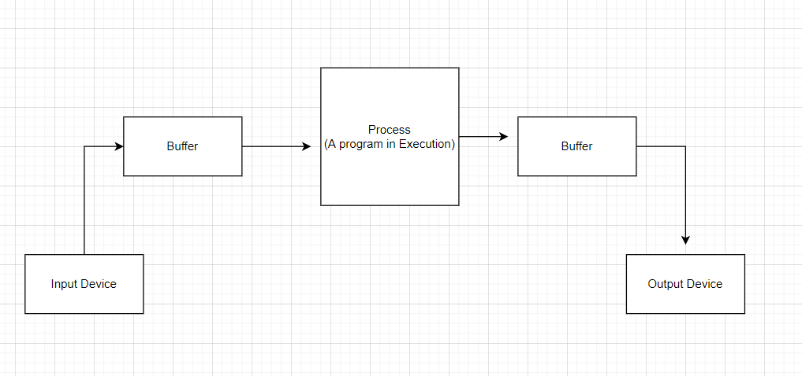
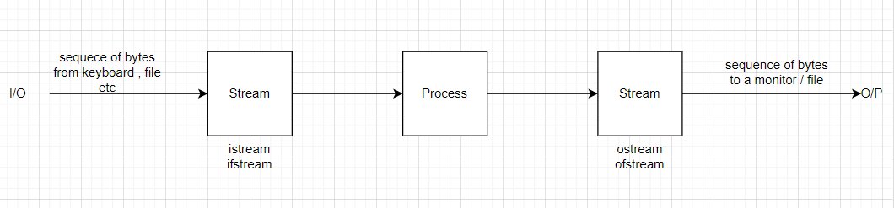

# Variables in C++

Soring data in a program, then variables comes.

There are two places where variables can store

1. Stack
2. heap

There are primitive data types are given.
Using those only we can create even others.
Each of them has their own work and size\

int - 4bytes (depend on compiler) - limitied to what kind of numbers we can store : -2billion to 2 billion

```c++


#include <iostream>

int main()
{
    int num = 8;
    std::cout << num;
}
```

1byte = 8bits

4bytes = 32bits

Since its signed then one bit has to be for sign

so we are left for 31 bits

Then the possibility is 2 to power 31 which is around 2 billion

If we want to remove the sign and use only postive then we can use _unsigned int_

hence for this we get 2 to power 32 bits

```c++
#include <iostream>

int main()
{
    unsigned int num = 8;
    std::cout << num;
}
```

Basic data types for integer :

1. char - generally 1 byte
2. short
3. long
4. long long

Note : we can use unsigned for everybody

For decimal we can use :

1. float - 4bytes
2. double - 8bytes

Bool data type : 1byte data

1. true - any other number than 0
2. false - 0

Why it it bye. Since accesing bit is tough we need more data to access it so we store it is as byte

```c++
#include <iostream>

int main()
{
    unsigned int num = 8;
    std::cout << sizeof(num);
}
```

sizeof operator is used for printing the size of each data types.

- An operator in C++ is evaluated at compiled time.

- size of operator returns the size in bytes

- this can be used with any variables and literals also

# static_cast<variable type>

- this is the new C++ way to convert any variable type.
- Here it does the check in compile time only that if the value or the literal can be converted or not.

# How input output works in c++



- Since the input and the output device can be very slow so taking input directly from this would be a problem.

- so we make use of Buffer where we first store before output and after input device.



- Here istream and ostream are input from keybpard and ouput respectively.

- The ifstream and ofstream are for files.

- **cin** - The object of istream class
- **cout** - The object of ostream class
- **cerr & clog** - Object of ostreams under error and log streams.

# Note: -

- getline(cin ,varablename) = is used to get strings with spaces.

# I/O manupulation

```c++
#include <iostream>

int main(int argc, char const *argv[])
{
    bool a = true;
    std::cout << a << std::endl; // 1
    std::cout << std::boolalpha;
    std::cout << a << std::endl; // true
    std::cout << std::noboolalpha;
    return 0;
}
```

```c++
#include <iostream>

using namespace std;

int main(int argc, char const *argv[])
{
    int a = 26, b = 20;
    cout << a << " " << b << endl; // 26 20
    cout << std::hex;
    cout << a << " " << b << endl; // 1a 14
    cout << std::oct;
    cout << a << " " << b << endl; // 32 34
    cout << std::dec;
    cout << a << " " << b << endl; // 26 20
    return 0;
}
```

## Some other i/o manupulations are as :

1. setw(n) - " 12" (takes 5 space is less than 5 also, if more then it will take all space whaterver it has)

2. setfill(n) = "\*\*\*123" (Same as setw but just adds some character in place of space)

3. std::left

4. std::right

# Foating Point (Default Printing Format)

- No trailing Zero
- Default Precision value is zero
